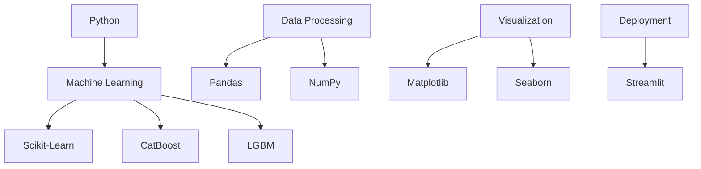

# 🌱 Crop & Fertilizer AI Recommendation System

[](https://github.com/Raviteja5469/project---crop-fertilizers)
[](https://www.linkedin.com/in/ravi-teja-61190a253)

## 🎯 Overview

An intelligent agricultural solution that leverages AI to provide personalized crop and fertilizer recommendations based on:
- Soil composition analysis
- Weather conditions
- Specific crop requirements

## ✨ Key Features

- 🤖 AI-powered recommendation engine  
- 🌡️ Real-time weather integration  
- 🧪 Soil composition analysis  
- 🎯 Precision farming capabilities  
- 📊 Interactive data visualization  
- ⚡ Real-time predictions  

## 🛠️ Tech Stack



## 📊 Model Architecture

### Data Pipeline
1. **Data Collection & Preprocessing**  
   - Exploratory Data Analysis (EDA)  
   - Feature Engineering  
   - Label Encoding  

2. **Model Training**  
   - Multiple ML algorithms evaluation  
   - Ensemble Learning implementation  
   - Cross-validation  

### Datasets
#### Crop Dataset Features
- Nitrogen  
- Phosphorous  
- Potassium  
- Temperature  
- Humidity  
- pH  
- Rainfall  

#### Fertilizer Dataset Features
- Temperature  
- Humidity  
- Moisture  
- Soil Type  
- Crop Type  
- NPK Values  

## 🚀 Getting Started

1. **Clone the Repository**  
   ```bash
   git clone https://github.com/Raviteja5469/project---crop-fertilizers
   ```

2. **Install Dependencies**  
   ```bash
   pip install -r requirements.txt
   ```

3. **Launch Application**  
   ```bash
   streamlit run app.py
   ```

## 📈 Future Roadmap

- [ ] Expand crop & soil type database  
- [ ] Integrate IoT sensor data  
- [ ] Implement satellite imagery analysis  
- [ ] Add mobile application support  
- [ ] Enhance model accuracy  

## 👥 Contributing

Contributions are welcome! Please feel free to submit a Pull Request.

## 📞 Contact

| Platform | Link |
|----------|------|
| **Author** | Raviteja |
| **E-mail** | ravitejaseguri@gmail.com |
| **GitHub** | [Raviteja5469](https://github.com/Raviteja5469) |
| **LinkedIn** | [Seguri Raviteja](https://www.linkedin.com/in/ravi-teja-61190a253) |

## 📄 License

This project is open-source and available under the MIT License.

---

<p align="center">
Made with ❤️ by Seguri Raviteja
</p>
